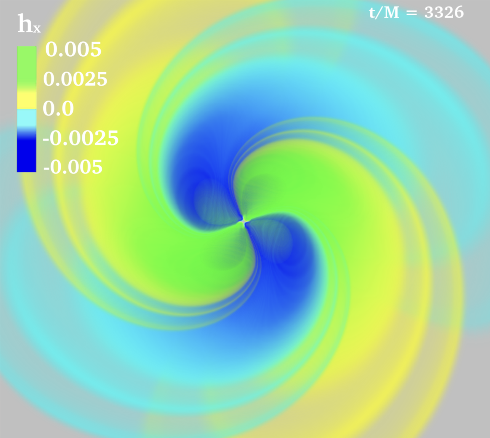
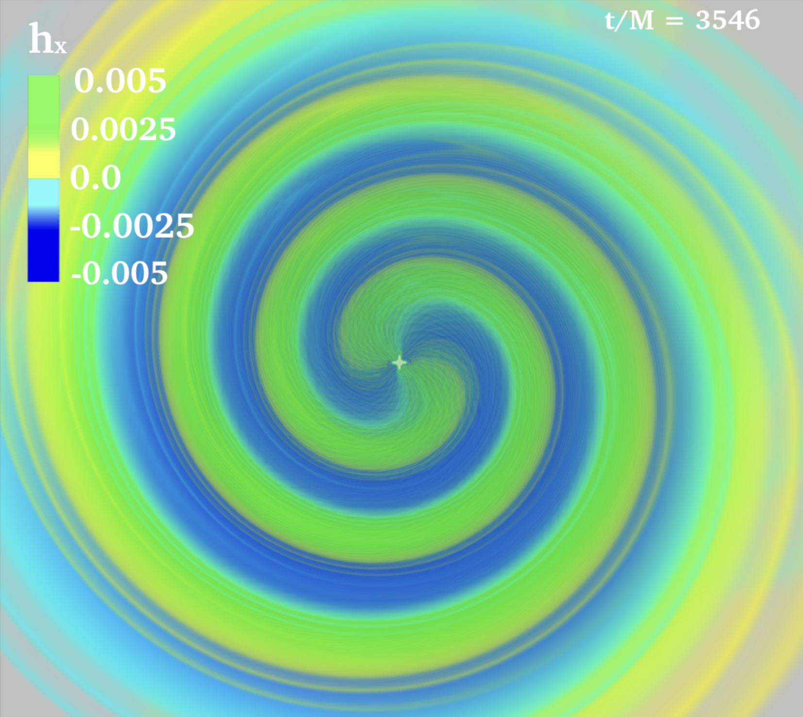
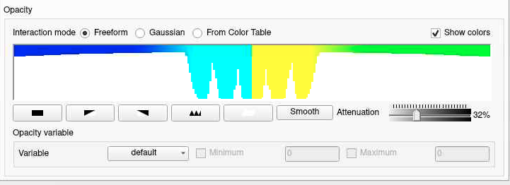
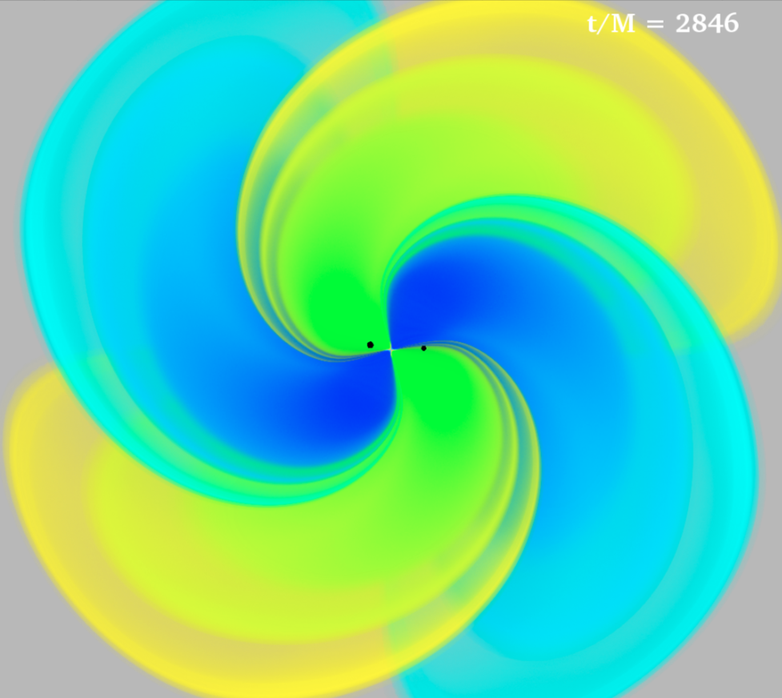
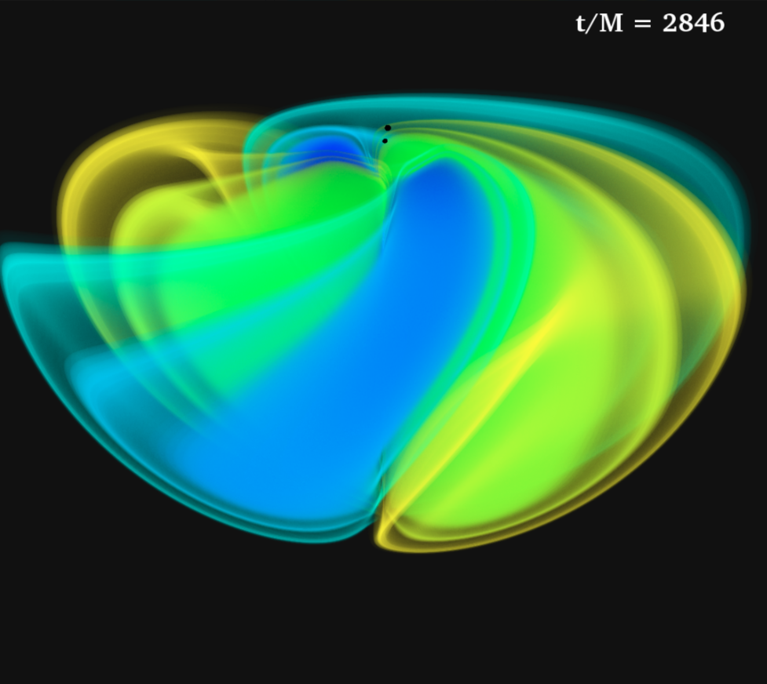
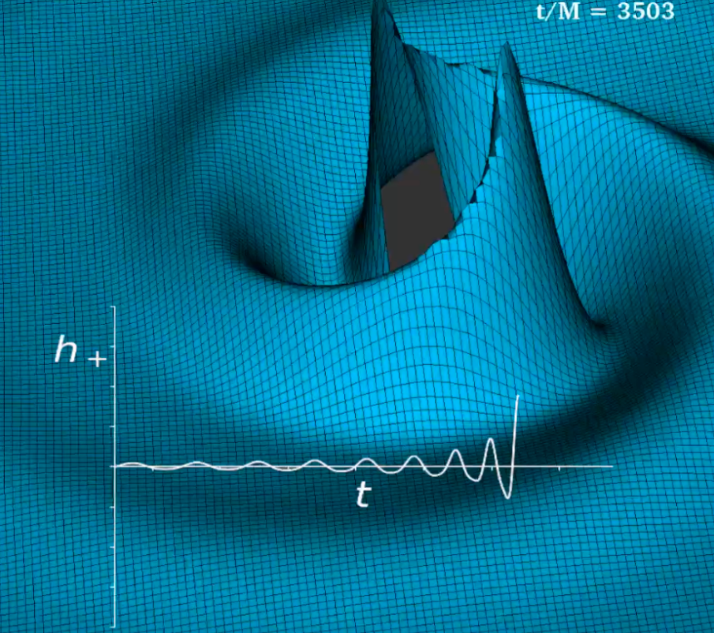
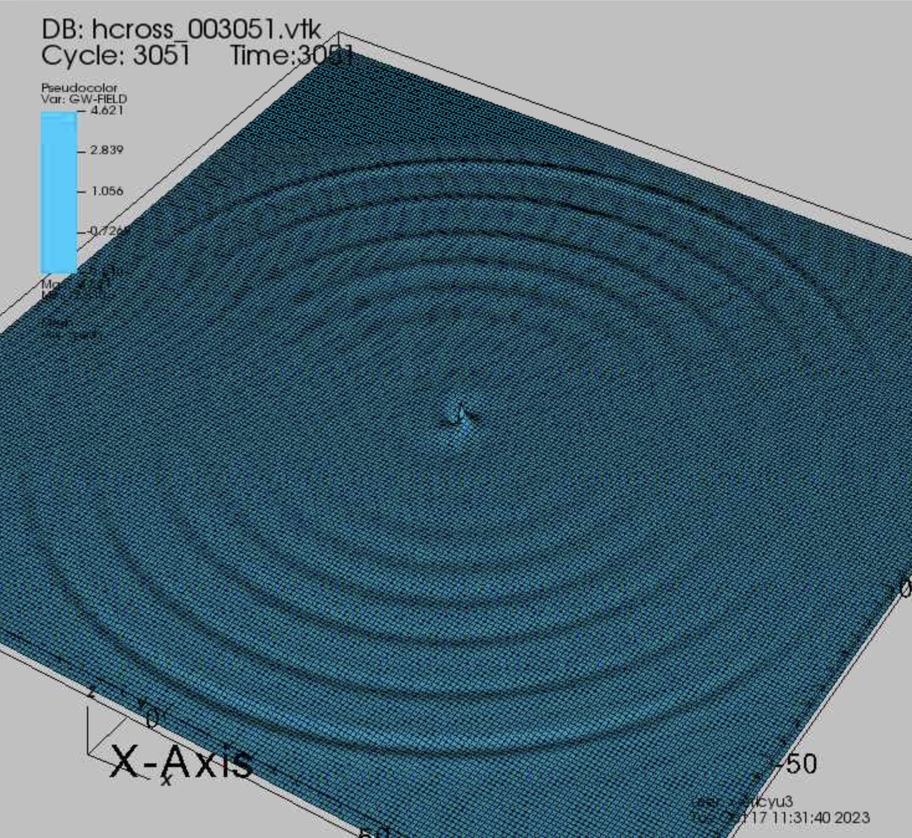

# Visualizing Gravitational Waves
In this section we will discuss how to visualize gravitational waves using numerical relativity
simulation data. Gravitational wave movies can provide helpful intuition about the systems being
simulated. When they are examined in conjunction with movies of the sources that produce them,
broad insights related to gravitational wave emission can be deduced. These visualizations will use
the following simulation output database:

## Post-Processing Implementation

## Three Dimensional Volume Plot
In this section, we will discuss how to visualize gravitational waves using a volume plot of the scalar
field h+ or h× in three dimensions. The main difference between volume rendering of density and
volume rendering of gravitational waves is our choice of opacity and colorbar. The range of data is
symmetric about zero. Since we are making a volume plot, we should strategically choose settings
to bring out the wavelike nature of the data we are working with.

Since the range of the data is symmetric about zero, we want to choose a colorbar that has this
symmetry as well. Additionally, we want the colorbar to also tell us something about the magnitude
of the wave. The decision that we’ve made is to choose darker colors for higher magnitudes and
lighter colors for lower magnitudes. For the actual colors, we went with yellow (cyan) for positive (negative) values with lower magnitudes, and green (blue) for the positive (negative) values with
higher magnitudes. The final colorbar can be seen in Fig. 67.

    
Figure 67: 3D volume rendering of gravitational waves.

For the opacity, we also want to make it symmetric about zero. Next, we want to make sufficiently
small magnitudes transparent. If we didn’t, then the entire visualization will be dominated by values
that are zero or near zero. Additionally, we’d like the larger magnitudes to have higher opacity than
the lower magnitudes so they stand out in the final visualization. An optional trick that we use
to further bring out the wavelike nature of the data is to add small peaks in the lower magnitude
parts of the opacity array. Adding these peaks creates more “wavelike” parts of the volume plot
that propagate outwards when a movie is created. In Fig. 67, these peaks are reflected by the more
pronounced “stripes” of yellow and cyan on the outer edge of the visualization. The opacity array
with the above features as displayed in the VisIt GUI is shown below in Fig. 68. Here, we can see
how the region around zero (where cyan turns to yellow) has zero opacity. We can also see the
peaks in the lower magnitude parts of the colorbar (yellow and cyan) as well as higher opacities for
the higher magnitude parts of the colorbar (green and blue).

After choosing the volume settings and exporting them to .xml files as described in Sec. 4.4,
volume plots of the strain h can be made as we’ve done previously (e.g. Sec. 4.2.1).

As mentioned earlier, the 3D data we are working with is only present in the lower half of R^3, where z < 0, so we can see a cross-section on the xy-plane. To visualize this entire cross-section, we
usually choose a top-down view (i.e. with a view normal of the form (0, 0, +z)). This top-down view
can be seen on the left-hand side of Fig. 69. Another option that brings out the three-dimensional
nature of our data is to pick a side view, which can be seen on the right-hand side.

After the volume settings and view are decided, all that is left to do in order to create a movie,
is to use these settings to produce stills for every time step. When we create the t/M label in these
images that show the time step, we remember that the original Psi4 rad.mon.# data file we used
was extracted at a radius rareal from the origin. That means that waves take a time t = rareal to propagate from the origin to the extraction radius. Since we want to compare our gravitational
wave visualizations directly with the movies of the compact object sources, we must subtract rareal
from the times. So we are actually using (t-r areal)/M to label our images. See the link below for
an example of a gravitational wave movie that was created using data from a binary black hole
simulation.

    
Figure 68: Volume opacity array for gravity wave 3D rendering.

    
Figure 69: Different viewing angles of 3D gravitational wave data

## Two Dimensional Contour Plot

In this section, we will discuss how to visualize gravitational waves using a contour plot. This type
of plot visualizes the strain h+ or h× on a two-dimensional slice of three-dimensional space. The strain is visualized as a surface h(u, v) where u, v are the two orthogonal coordinates that span the
two-dimensional slice. While this contour plot only visualizes a 2D slice of the data, it doesn’t rely
on changing the colorbar and opacity to only visualize certain magnitudes. It also is more intuitive
since visualizing gravitational waves on a surface can be imagined as “ripples on a pond”.

To create a contour plot, we will use a Pseudocolor and Mesh plot with the Elevate operator
applied. Optionally, we can add a Resample operator and a Cylinder operator. Their purposes
are outlined below.

    
Figure 70: Contour Plot of Gravitational Waves on the xy-Plane

    
Figure 71: Example of edges of grid being visible

