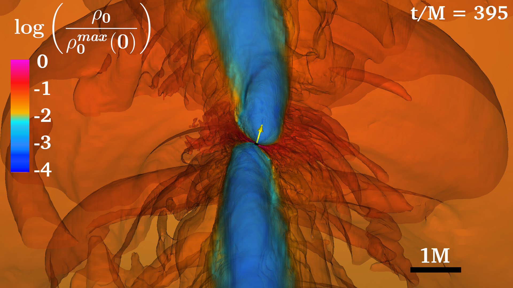
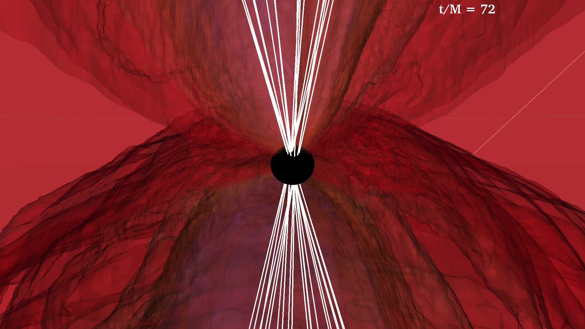
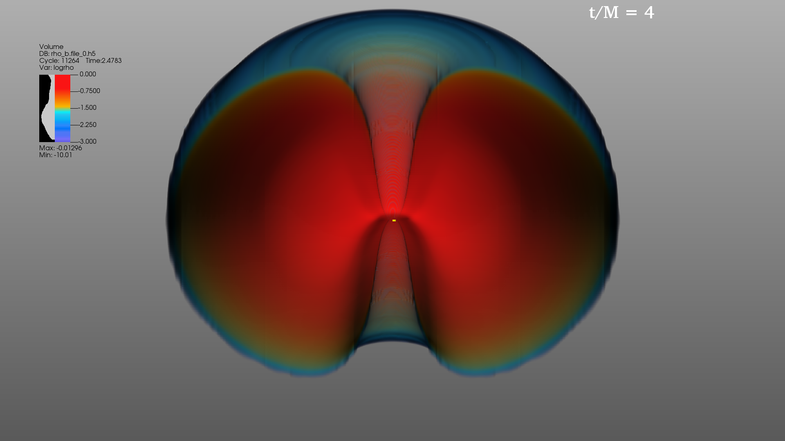
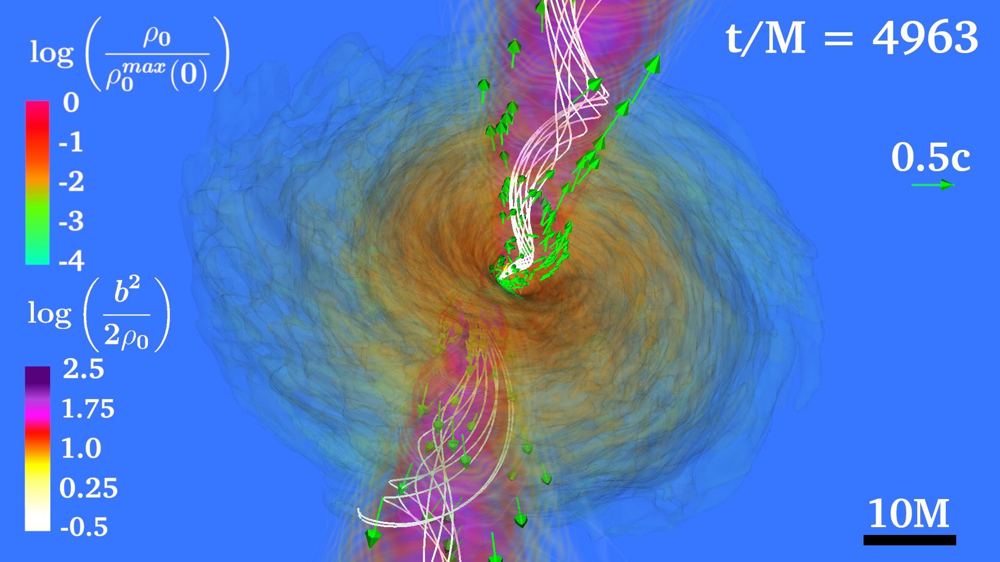

# Case Study: Black Hole with Accretion Disk
The second case study will be of a black hole surrounded by an accretion disk, which we will refer to
in this section as a BH-disk (BHD). BHDs can be found in active galactic nuclei or in the aftermath
of binary neutron star mergers. The BHD data we will use in this section will be of a rapidly
spinning black hole surrounded by a self-gravitating accretion disk where the spin of the BH is tilted
with respect to the angular momentum of the disk. The accretion disk is seeded with a poloidal
magnetic field. As matter accretes onto the BH, a relativistic jet develops. Visualizations of the
BHD use the following simulation output databases:

<ul>
    <li><code>rho_b.file_*.h5:</code> HDF5 data of the fluid rest-mass density $\rho_0$</li>
    <li><code>Bx.file *.h5, By.file *.h5, Bz.file *.h5:</code> HDF5 data of the magnetic field</li>
    <li><code>vx.file *.h5, vy.file *.h5, vz.file *.h5:</code> HDF5 data of the fluid velocity</li>
    <li><code>smallb2.file *.h5:</code>  HDF5 data of b2 ≡ B2/(4π) where B is the magnitude of the magnetic field.</li>
    <li><code>h.t*.ah1.gp:</code> Horizon data that lists a set of points on the apparent horizon of the black hole.</li>
    <li><code>BH diagnostics.ah1.gp:</code>  ASCII black hole diagnostic file containing information about the
apparent horizon of the black hole.</li>
    <li><code>BHspin.mon:</code> ASCII file containing the black hole spin vector at each iteration</li>
</ul>

In this case study, we will focus on visualizations of the density, which was glossed over when we
made visualizations of the magnetars in Sec. 6. We will go over in detail how to find good settings
for visualizing the density using both isosurface and volume rendering techniques.

## Isosurface Rendering of Disk
Using the databases mentioned above, we will make the following plots.

<ul>
    <li><b>Isosurface</b> of <b>Volume</b> plot of log$\left(\frac{\rho_0}{\rho_0(0)}\right)$, which will visualize the accretion disk.</li>
    <li><b>Pseudocolor</b> plot  of the apparent horizon of the black hole.</li>
    <li><b>Vector</b> plot of the black hole spin.</li>
</ul>

This section focuses on designing the BHD visualizations seen within in Figs. 50 and 51. There
were a number of different visualization parameter decisions with their respective trade-offs made
within this figures. To begin with, we created these visualizations using isosurface rendering as
described in Sec. 4.2.2, utilizing layers of shells to model the different density values. Volume
rendering is a more computational intensive operation in comparison to isosurface rendering, and isosurface rendering allows for a lot more flexibility when iterating through the visualization
development process. The salient features for isosurface and volume rendering have been discussed
in Sec. 4.2.2 and Sec. 4.2.1. Here we will discuss specific details regarding the visualization of BHDs
using isosurface rendering.

Figure 50: Isosurface zoom in of a massive BHD. At t = 0 the angular momentum of the disk is
along the z axis, while the spin of the black hole (yellow arrow) is at 45◦
from the z axis.
{: style="text-align: center;"}

Figure 50: Isosurface zoom in of a massive BHD. At t = 0 the angular momentum of the disk is
along the z axis, while the spin of the black hole (yellow arrow) is at 45◦
from the z axis.
{: style="text-align: center;"}

Figure 51: Isosurface zoom out of the massive BHD of Fig. 50
{: style="text-align: center;"}

Figure 51: Isosurface zoom out of the massive BHD of Fig. 50
{: style="text-align: center;"}

Starting with the shells, the number amount of them and their distribution across the data play a
vital role in what information is highlighted within the visualization. Within this simulation, there is
significant variation in the fluid density within the inner torus of the BHD. Through experimentation,
we found that there was quite a bit of fluid movement and variation for the fluid density values
between -1 to -2 (log scale), therefore adding more shells within this region, can better communicate
the fluid dynamics across the evolution. In the same light, the following parameters are different
characteristics to be considered in order to maximize the information communicated:

Figure 52: Black hole-disk visualization using a limited color table.
{: style="text-align: center;"}

Figure 53: Black hole-disk visualization with improved color table.
{: style="text-align: center;"}

## Volume Rendering of Disk

Figure 54: Base image of the BHD through volume rendering
{: style="text-align: center;"}

Figure 55: Distribution of freeformOpacity values
{: style="text-align: center;"}

Figure 56: Final image of the BHD with volume rendering
{: style="text-align: center;"}

## Magnetic Field Lines around the Black Hole

Figure 57: Finding proper grid seeds for BHD magnetic field lines
{: style="text-align: center;"}

## Visualizing a Relativistic Jet

Figure 58: BHD jet with volume plot of log
{: style="text-align: center;"}
