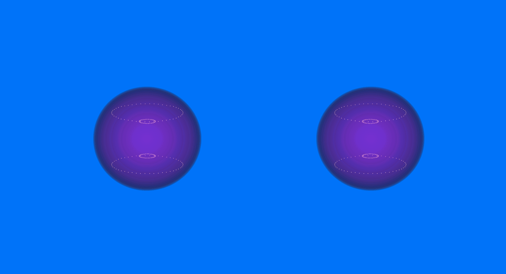
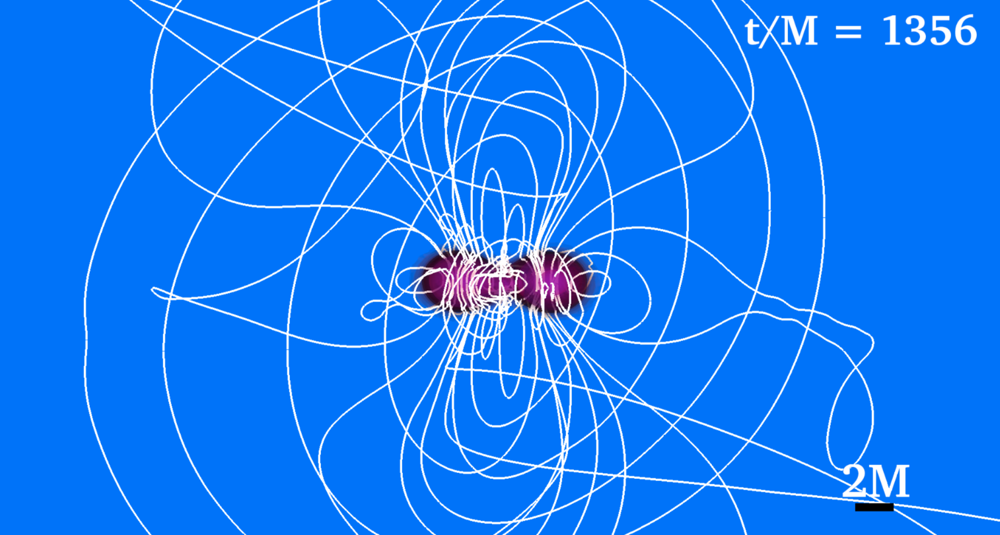
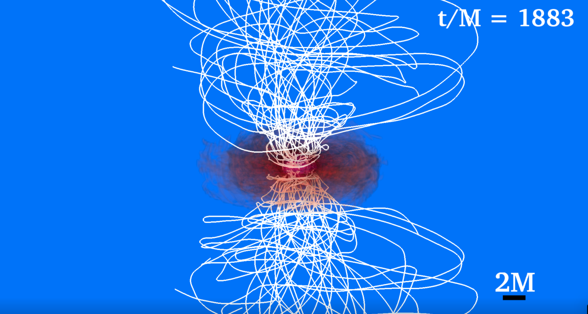
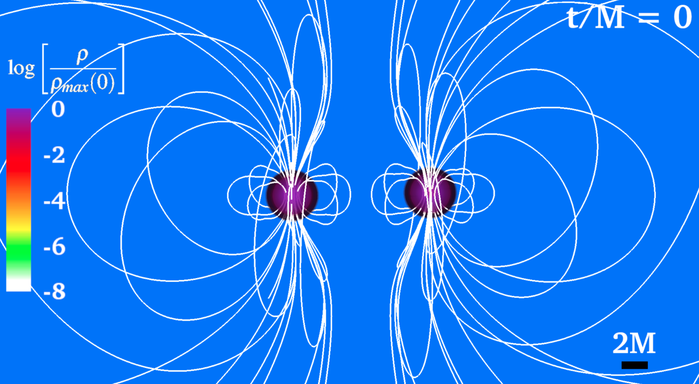
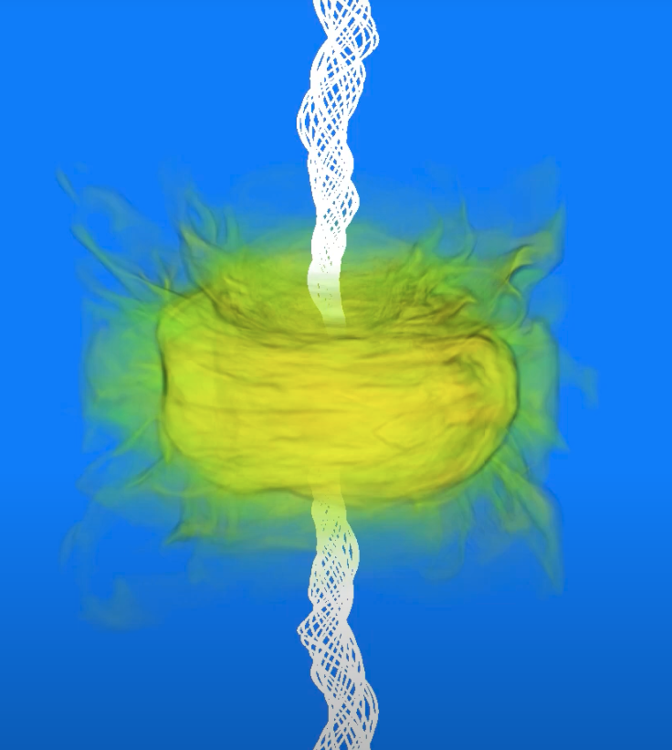
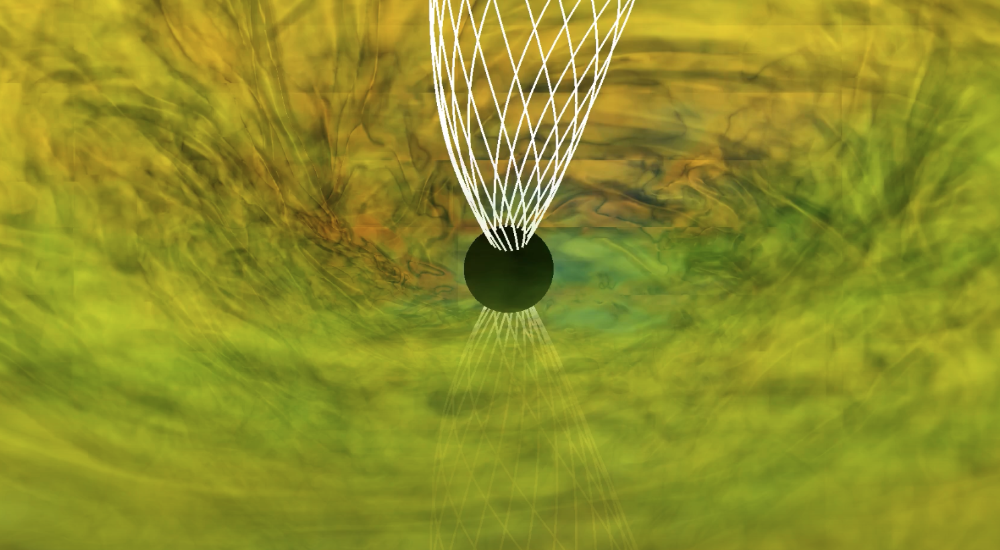
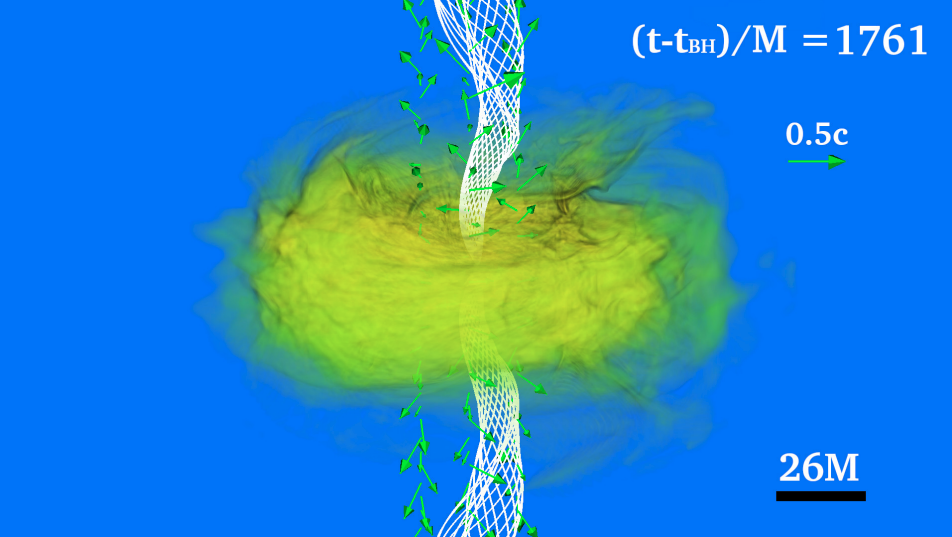

# Case Study: Binary Neutron Stars
The third case study will be the visualization of a binary neutron star system. Following event
GW170817, such binaries constitute prime candidates for multimessenger astronomy and therefore
visualizations of magnetized simulations are important. The figures that will be produced in this
section correspond to the simulations discussed in [6] and consist of mergers of identical irrotational
neutron stars with dipole-like magnetic fields extending outside the stars to infinity. We will use the
same techniques discussed in the case study of a single neutron star in Sec. 6. In addition, these
visualizations will also draw from techniques discussed in the case study of a BHD in Sec. 7 since
after the merger of two neutron stars, a black hole surrounded by an accretion disk usually forms.
These visualizations will use the following simulation output databases:

Using these databases, we will make visualizations across the entire evolution. In the case that we
will visualize, after the merger of the neutron stars, a hypermassive neutron star forms which will
eventually collapse into a black hole. We will split up the visualizations into two sections: pre-black
hole formation and post-black hole formation.

## Before Black Hole Formation

Figure 59: Particle seeded magnetic field lines in a binary neutron star.
{: style="text-align: center;"}

Figure 60: Evolution of binary neutron star with particle field lines.
{: style="text-align: center;"}

The remnant hypermassive neutron star will eventually (sometimes immediately) collapse into a black hole. After the neutron star collapses into a black hole, there are some things we must change in our visualizations.

## After Black Hole Formation

Figure 61: Changes made after black hole formation
{: style="text-align: center;"}

## Additional Plots After Merger

Figure 62: Additional plots to confirm the existence of an incipient jet
{: style="text-align: center;"}
