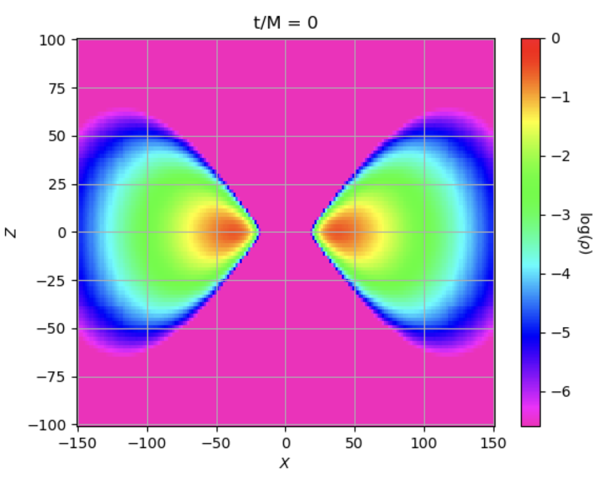
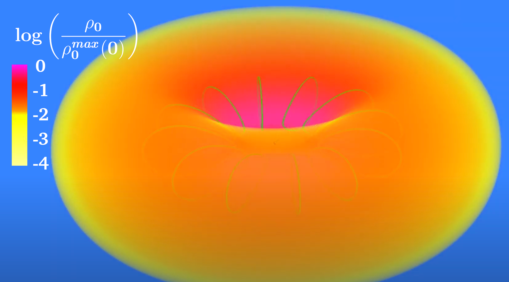
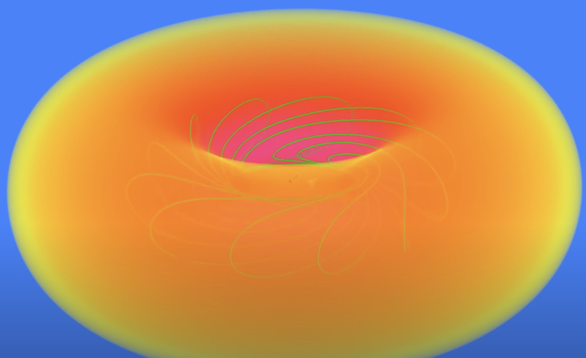
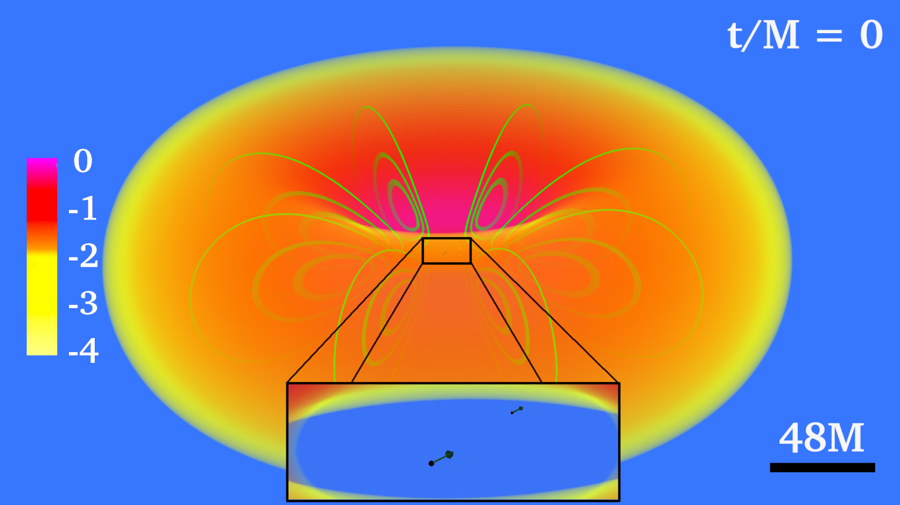
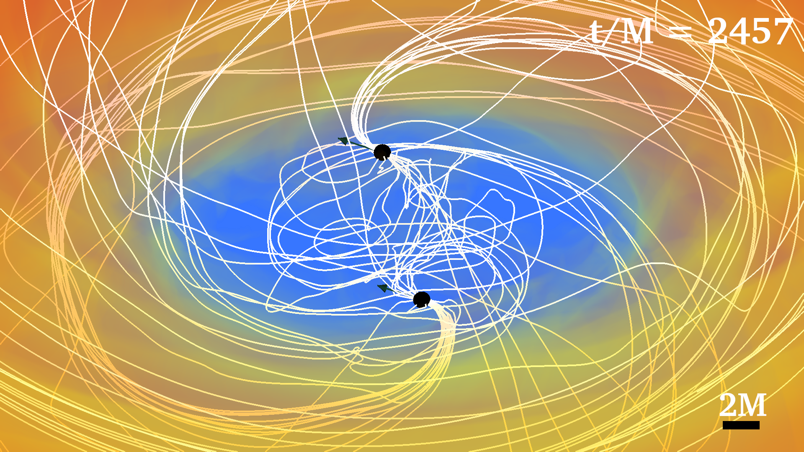
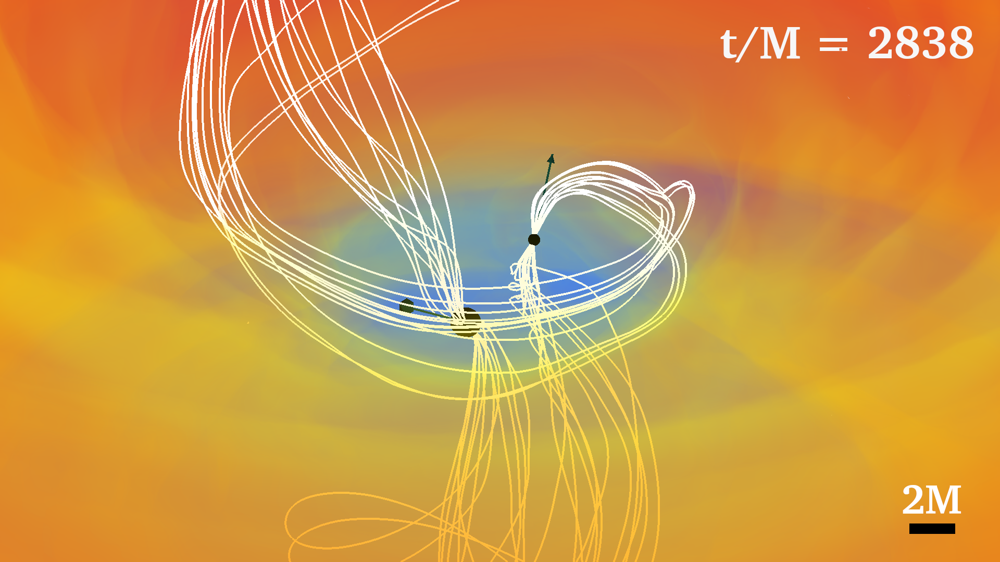
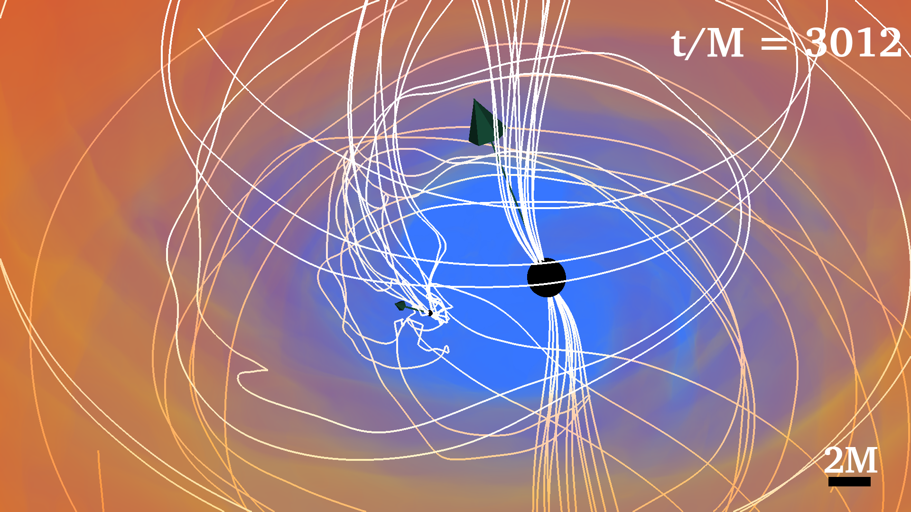

# Case Study: Binary Black Hole with Accretion Disk
The fourth case will study the visualization of a binary black hole system surrounded by a magnetized
accretion disk (BBHD). These BBHDs correspond to the simulations discussed in [7]. In these
cases, the spins of the black holes are tilted with respect to the orbital angular momentum. The
visualizations we will make of these BBHDs will use techniques discussed in all of the earlier case
studies. We will use the following simulation output databases:

## Magnetic Field Lines in the Disk

    
Figure 63: 2D xz-slice of the density data.

    
Figure 64: Magnetic field lines inside accretion disk

## Two Black Holes

    
Figure 65: Plotting Two Black Holes and Spin Vectors Example

We’ve left out the num seeds per ring parameter since the best choice depends on the mass of the
black hole. For example, in the 1:1 mass ratio case, we choose to set this parameter to 8 for each
black hole. However, for the 4:1 mass ratio case, we choose to only use 4 per ring for the smaller
black hole (still having 8 seeds per ring for the larger one). Below in Fig. 66, we show magnetic
fields seeded by grid points around the black holes for the 1:1, 2:1, and 4:1 mass ratio binary BHD
cases.

    
Figure 66: Magnetic field lines around black holes in a black hole binary system.

